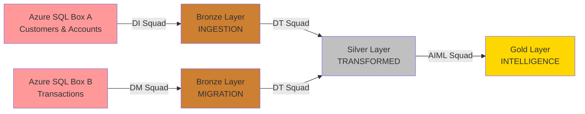

# APJ Tech Summit - End-to-End Data Pipeline Demo
## Multi-Squad Presentation Plan

---

## 🎯 **Summit Overview**

This summit demonstrates a complete modern data pipeline using the **Medallion Architecture** (Bronze → Silver → Gold), showcasing collaboration between four specialized squads to deliver an end-to-end data solution.

### **Pipeline Story Arc**
> *"From raw data ingestion to AI-powered insights: A journey through modern data engineering"*

**Data Flow**: Azure SQL → Snowflake Ingestion → Migration → Transformation → AI/ML Intelligence

---

## 🏗️ **Architecture Overview**

### **Medallion Layer Mapping**

| Layer | Purpose | Squads | Data State |
|-------|---------|---------|------------|
| **🥉 Bronze** | Raw Data Landing | DI + DM | Ingested/Migrated as-is |
| **🥈 Silver** | Cleaned & Transformed | DT | Business logic applied |
| **🥇 Gold** | Analytics-Ready | AIML | Semantic models & insights |

### **Environment Strategy**

| Environment | Purpose | Database | Access |
|-------------|---------|----------|---------|
| **CAS2** | Live Demo | `APJ_SUMMIT` | Presenter-driven |
| **Sandboxes** | Hands-On Labs | `APJ_SUMMIT` | Participant-driven |

---

## 📊 **Data Assets Overview**

| Dataset | Size | Source | Squads Using | Purpose |
|---------|------|--------|--------------|---------|
| **Customers** | 1M rows | Azure SQL Box A | DI → DT → AIML | Customer master data |
| **Accounts** | 1M rows | Azure SQL Box A | DI → DT → AIML | Account master data |
| **Transactions** | 50M rows | Azure SQL Box B | DM → DT → AIML | Transaction fact data |

---

## 🚀 **Squad Responsibilities & Deliverables**

### **Squad 1: Data Ingestion (DI)**
> *"Getting data from source systems into Snowflake"*

#### 📋 **Mission**
Demonstrate modern data ingestion patterns using Snowflake's native capabilities to bring customer and account data from Azure SQL into the Bronze layer.

#### 🎬 **Demo Component** (CAS2)
- **Mode**: ❌ No Demo (for now)
- **Status**: Pre-loaded for story continuity

#### 🧪 **Hands-On Lab Component** (Sandboxes)
- **Mode**: ✅ Hands-On Lab Only
- **Activity**: Participants ingest live data from Azure SQL Box A
- **Tools**: Snowflake OpenFlow / Native Connectors
- **Target Schema**: `APJ_SUMMIT.INGESTION`
- **Deliverables**:
  - Live ingestion of customers table (1M rows)
  - Live ingestion of accounts table (1M rows)
  - Data quality validation
  - Ingestion monitoring dashboard

#### 🏢 **Technical Stack**
```sql
-- Target Location (Hands-On Lab)
DATABASE: APJ_SUMMIT
SCHEMA: INGESTION
LAYER: BRONZE

-- Tables Created:
- CUSTOMERS (1M rows)
- ACCOUNTS (1M rows)
```

#### 📈 **Success Metrics**
- ✅ 100% data ingestion success rate
- ✅ < 5 minute ingestion time per table
- ✅ Zero data quality issues detected

---

### **Squad 2: Data Migration (DM)**
> *"Migrating large-scale legacy data efficiently"*

#### 📋 **Mission**
Showcase enterprise-scale data migration capabilities, moving 50M transaction records from legacy systems to Snowflake's Bronze layer with optimal performance.

#### 🎬 **Demo Component** (CAS2)
- **Mode**: ✅ Demo Only
- **Activity**: Live migration demonstration from Azure SQL Box B
- **Focus**: Performance, scalability, error handling
- **Target Schema**: `APJ_SUMMIT.MIGRATION_TARGET`

#### 🧪 **Hands-On Lab Component** (Sandboxes)
- **Mode**: 📊 Data Share Distribution
- **Strategy**: Pre-migrated data shared via Snowflake Marketplace
- **Participant Action**: "Get" shared data into their sandbox
- **Target Schema**: `APJ_SUMMIT.MIGRATION`

#### 🏢 **Technical Stack**
```sql
-- Demo Environment (CAS2)
DATABASE: APJ_SUMMIT  
SCHEMA: MIGRATION_TARGET
LAYER: BRONZE

-- Hands-On Lab Environment (Sandboxes)
DATABASE: APJ_SUMMIT
SCHEMA: MIGRATION  
LAYER: BRONZE

-- Tables:
- TRANSACTIONS (50M rows)
```

#### 📊 **Data Share Configuration**
```sql
-- Data Share Setup (Pre-Summit)
CREATE SHARE APJ_SUMMIT_TRANSACTIONS_SHARE;
GRANT USAGE ON DATABASE APJ_SUMMIT TO SHARE APJ_SUMMIT_TRANSACTIONS_SHARE;
GRANT USAGE ON SCHEMA MIGRATION_TARGET TO SHARE APJ_SUMMIT_TRANSACTIONS_SHARE;
GRANT SELECT ON TABLE TRANSACTIONS TO SHARE APJ_SUMMIT_TRANSACTIONS_SHARE;

-- Participant Action Required
-- GET 'APJ_SUMMIT_TRANSACTIONS_SHARE' FROM MARKETPLACE;
```

#### 📈 **Success Metrics**
- ✅ 50M rows migrated in < 10 minutes
- ✅ Zero data loss during migration
- ✅ All participants successfully access shared data

---

### **Squad 3: Data Transformation (DT)**
> *"Turning raw data into business-ready insights"*

#### 📋 **Mission**
Demonstrate modern data transformation using DBT with AI-powered development, creating clean, business-ready datasets in the Silver layer.

#### 🎬 **Demo Component** (CAS2)
- **Mode**: ✅ Live Demo
- **Activity**: AI-assisted DBT model creation using Cursor IDE
- **Focus**: Gen AI capabilities, data quality, business logic
- **Source**: `INGESTION_TARGET` + `MIGRATION_TARGET` schemas
- **Target Schema**: `APJ_SUMMIT.TRANSFORMED`

#### 🧪 **Hands-On Lab Component** (Sandboxes)
- **Mode**: ✅ Hands-On Lab
- **Activity**: Participants create their own DBT transformations
- **Prerequisites**: Data from DI Squad + DM Squad data share
- **Tools**: DBT, Cursor IDE with AI assistance
- **Target Schema**: `APJ_SUMMIT.TRANSFORMED`

#### 🏢 **Technical Stack**
```sql
-- Target Location (Both Environments)
DATABASE: APJ_SUMMIT
SCHEMA: TRANSFORMED  
LAYER: SILVER

-- Source Tables:
- INGESTION.CUSTOMERS (1M rows)
- INGESTION.ACCOUNTS (1M rows)  
- MIGRATION.TRANSACTIONS (50M rows)

-- Target Models:
- DIM_CUSTOMERS (enriched, cleansed)
- DIM_ACCOUNTS (enriched, cleansed)
- FACT_TRANSACTIONS (business rules applied)
- CUSTOMER_ACCOUNT_SUMMARY (aggregated)
```

#### 🤖 **AI-Powered Transformation Examples**
```python
# Example DBT model generation with AI assistance
# AI Prompt: "Create a DBT model that joins customers, accounts, and transactions 
# to calculate monthly account balances with proper SCD Type 2 handling"

{{ config(materialized='table') }}

WITH customer_accounts AS (
    SELECT 
        c.customer_id,
        c.customer_name,
        a.account_id,
        a.account_type,
        a.account_status
    FROM {{ ref('dim_customers') }} c
    JOIN {{ ref('dim_accounts') }} a ON c.customer_id = a.customer_id
),

monthly_transactions AS (
    SELECT 
        account_id,
        DATE_TRUNC('month', transaction_date) as month_year,
        SUM(transaction_amount) as monthly_total,
        COUNT(*) as transaction_count
    FROM {{ ref('fact_transactions') }}
    GROUP BY account_id, DATE_TRUNC('month', transaction_date)
)

SELECT * FROM customer_accounts ca
LEFT JOIN monthly_transactions mt ON ca.account_id = mt.account_id
```

#### 📈 **Success Metrics**
- ✅ 100% data quality tests pass
- ✅ < 5 minute transformation runtime
- ✅ AI generates 80%+ of transformation logic correctly

---

### **Squad 4: AI/ML Intelligence (AIML)**
> *"From data to insights: AI-powered analytics"*

#### 📋 **Mission**
Showcase Snowflake's native AI/ML capabilities, creating semantic models and intelligent insights from the transformed Silver layer data.

#### 🎬 **Demo Component** (CAS2)
- **Mode**: ✅ Live Demo
- **Activity**: Create semantic views and run Snowflake Intelligence queries
- **Focus**: Cortex AI, semantic modeling, natural language queries
- **Source**: `APJ_SUMMIT.TRANSFORMED` schema
- **Target Schema**: `APJ_SUMMIT.INTELLIGENCE`

#### 🧪 **Hands-On Lab Component** (Sandboxes)
- **Mode**: ✅ Hands-On Lab
- **Activity**: Participants build their own AI-powered analytics
- **Prerequisites**: Completed transformations from DT Squad
- **Tools**: Snowflake Cortex, Semantic Models, Streamlit
- **Target Schema**: `APJ_SUMMIT.INTELLIGENCE`

#### 🏢 **Technical Stack**
```sql
-- Target Location (Both Environments)
DATABASE: APJ_SUMMIT
SCHEMA: INTELLIGENCE
LAYER: GOLD

-- Source Tables (From DT Squad):
- TRANSFORMED.DIM_CUSTOMERS
- TRANSFORMED.DIM_ACCOUNTS  
- TRANSFORMED.FACT_TRANSACTIONS
- TRANSFORMED.CUSTOMER_ACCOUNT_SUMMARY

-- Intelligence Assets:
- SEMANTIC_CUSTOMER_360 (semantic view)
- ML_CUSTOMER_SEGMENTS (ML model results)
- AI_INSIGHTS_DASHBOARD (Streamlit app)
```

#### 🧠 **AI/ML Capabilities Demonstrated**
```sql
-- 1. Semantic Model Creation
CREATE SEMANTIC MODEL CUSTOMER_360_MODEL
FROM (
    SELECT * FROM TRANSFORMED.CUSTOMER_ACCOUNT_SUMMARY
)
WITH DIMENSIONS (customer_name, account_type, month_year)
WITH MEASURES (monthly_total, transaction_count);

-- 2. Cortex AI Analysis
SELECT 
    customer_id,
    SNOWFLAKE.CORTEX.COMPLETE(
        'claude-3-5-sonnet',
        'Analyze this customer transaction pattern and provide insights: ' || 
        transaction_summary
    ) AS ai_insights
FROM INTELLIGENCE.CUSTOMER_TRANSACTION_PATTERNS;

-- 3. Natural Language Queries
SELECT SNOWFLAKE.CORTEX.COMPLETE(
    'snowflake-arctic',
    'What are the top 5 customers by transaction volume this quarter?'
) AS natural_language_query_result;
```

#### 📊 **Intelligence Deliverables**
1. **Semantic Views**: Business-friendly data models
2. **ML Models**: Customer segmentation, anomaly detection
3. **AI Insights**: Automated analysis and recommendations
4. **Interactive Dashboard**: Streamlit-powered analytics interface

#### 📈 **Success Metrics**
- ✅ Semantic models respond in < 3 seconds
- ✅ AI insights generated with 95%+ accuracy
- ✅ Natural language queries work for 90%+ of business questions

---

## 🔄 **End-to-End Data Flow**



---

## ⏱️ **Summit Timeline**

| Time | Squad | Activity | Duration | Audience Interaction |
|------|-------|----------|----------|---------------------|
| **0:00-0:15** | DI | Ingestion Demo Setup | 15 min | Watch & Learn |
| **0:15-0:30** | DM | Migration Demo | 15 min | Watch & Learn |
| **0:30-0:50** | DT | Transformation Demo + Lab | 20 min | Demo + Hands-On |
| **0:50-1:10** | AIML | Intelligence Demo + Lab | 20 min | Demo + Hands-On |
| **1:10-1:20** | All | Q&A + Wrap-up | 10 min | Interactive |

---

## 🛠️ **Pre-Summit Setup Requirements**

### **CAS2 Environment (Demo)**
```sql
-- Required databases and schemas
CREATE DATABASE IF NOT EXISTS APJ_SUMMIT;

-- DI Squad pre-loaded data
CREATE SCHEMA IF NOT EXISTS APJ_SUMMIT.INGESTION_TARGET;
-- Tables: CUSTOMERS, ACCOUNTS (pre-loaded)

-- DM Squad pre-loaded data  
CREATE SCHEMA IF NOT EXISTS APJ_SUMMIT.MIGRATION_TARGET;  
-- Tables: TRANSACTIONS (pre-loaded)

-- DT Squad target
CREATE SCHEMA IF NOT EXISTS APJ_SUMMIT.TRANSFORMED;

-- AIML Squad target
CREATE SCHEMA IF NOT EXISTS APJ_SUMMIT.INTELLIGENCE;
```

### **Sandbox Environment (Hands-On Labs)**
```sql
-- Participant databases (auto-created)
CREATE DATABASE IF NOT EXISTS APJ_SUMMIT;

-- Schema structure (per participant)
CREATE SCHEMA IF NOT EXISTS APJ_SUMMIT.INGESTION;      -- DI Lab
CREATE SCHEMA IF NOT EXISTS APJ_SUMMIT.MIGRATION;      -- DM Data Share
CREATE SCHEMA IF NOT EXISTS APJ_SUMMIT.TRANSFORMED;    -- DT Lab  
CREATE SCHEMA IF NOT EXISTS APJ_SUMMIT.INTELLIGENCE;   -- AIML Lab
```

### **Required Integrations**
- ✅ Azure SQL connectivity (Boxes A & B)
- ✅ Snowflake Data Share configuration
- ✅ DBT integration with Cursor IDE
- ✅ Cortex AI services enabled
- ✅ Streamlit environment configured

---

## 📋 **Success Criteria**

### **Technical Success**
- [ ] All data pipeline stages execute successfully
- [ ] Zero data loss across all transformations
- [ ] AI/ML models produce accurate insights
- [ ] Performance meets defined SLAs

### **Educational Success**
- [ ] Participants complete all hands-on labs
- [ ] 90%+ attendees understand medallion architecture
- [ ] Clear demonstration of AI-powered development
- [ ] End-to-end story resonates with audience

### **Business Success**
- [ ] Clear ROI story for modern data stack
- [ ] Demonstrates competitive advantages
- [ ] Shows practical AI/ML business applications
- [ ] Establishes thought leadership position

---

## 🎯 **Key Messages**

1. **"Modern data pipelines are collaborative"** - Multiple squads, one unified story
2. **"AI accelerates development"** - Gen AI tools speed transformation development
3. **"Snowflake simplifies complexity"** - Bronze → Silver → Gold made easy
4. **"Intelligence is built-in"** - Native AI/ML capabilities, no external tools needed
5. **"Scale without limits"** - From 1M to 50M+ rows seamlessly

---

*Ready to showcase the future of data engineering! 🚀*
