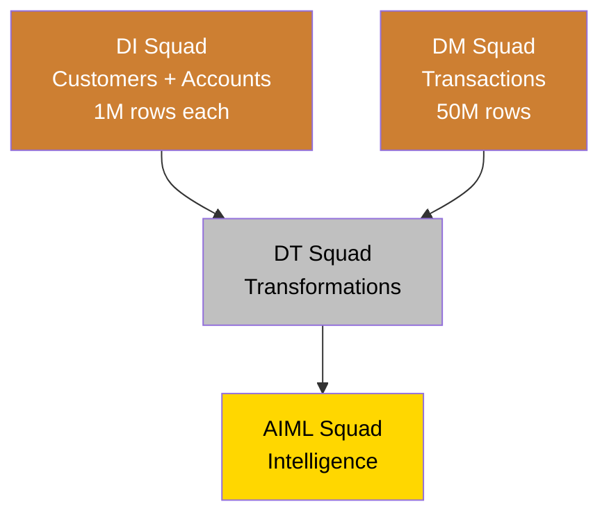

# APJ Summit - Quick Reference Guide
## Inter-Squad Coordination Summary

---

## 🏗️ **Architecture Quick View**

| Squad | Bronze Layer | Silver Layer | Gold Layer | Demo | Hands-On Lab |
|-------|--------------|--------------|------------|------|--------------|
| **DI** | ✅ INGESTION | - | - | ❌ | ✅ |
| **DM** | ✅ MIGRATION | - | - | ✅ | 📊 Data Share |
| **DT** | - | ✅ TRANSFORMED | - | ✅ | ✅ |
| **AIML** | - | - | ✅ INTELLIGENCE | ✅ | ✅ |

---

## 📊 **Schema Mapping by Environment**

### **CAS2 (Demo Environment)**
```
APJ_SUMMIT Database:
├── INGESTION_TARGET     (DI - Pre-loaded)
├── MIGRATION_TARGET     (DM - Demo target) 
├── TRANSFORMED          (DT - Demo target)
└── INTELLIGENCE         (AIML - Demo target)
```

### **Sandboxes (Hands-On Lab Environment)**  
```
APJ_SUMMIT Database:
├── INGESTION           (DI - Lab target)
├── MIGRATION           (DM - Data share target)
├── TRANSFORMED         (DT - Lab target)  
└── INTELLIGENCE        (AIML - Lab target)
```

---

## 🔄 **Data Dependencies**



---

## ⚠️ **Critical Pre-Summit Actions**

### **DM Squad - Data Share Setup**
```sql
-- MUST BE COMPLETED BEFORE SUMMIT
CREATE SHARE APJ_SUMMIT_TRANSACTIONS_SHARE;
GRANT USAGE ON DATABASE APJ_SUMMIT TO SHARE APJ_SUMMIT_TRANSACTIONS_SHARE;
GRANT USAGE ON SCHEMA MIGRATION_TARGET TO SHARE APJ_SUMMIT_TRANSACTIONS_SHARE;  
GRANT SELECT ON TABLE TRANSACTIONS TO SHARE APJ_SUMMIT_TRANSACTIONS_SHARE;

-- Participants must run this BEFORE attending:
-- GET 'APJ_SUMMIT_TRANSACTIONS_SHARE' FROM MARKETPLACE;
```

### **All Squads - Environment Verification**
- [ ] CAS2 access confirmed
- [ ] Sandbox environments provisioned
- [ ] Required integrations tested
- [ ] Sample data loaded/accessible

---

## 📋 **Presentation Flow & Handoffs**

| Sequence | Squad | Key Message | Handoff To Next Squad |
|----------|-------|-------------|----------------------|
| **1st** | DI | "Raw data lands in Bronze layer" | → DM: "Here's customer/account data" |
| **2nd** | DM | "Large-scale migration to Bronze" | → DT: "Here's transaction data" |  
| **3rd** | DT | "Business logic creates Silver layer" | → AIML: "Here's clean, joined data" |
| **4th** | AIML | "Intelligence creates Gold layer insights" | → End: "Business value delivered" |

---

## 🛠️ **Each Squad's 5-Minute Checklist**

### **DI Squad**
- [ ] Azure SQL Box A connection working
- [ ] OpenFlow ingestion pipeline ready
- [ ] Participants can access their INGESTION schema
- [ ] Sample customers/accounts data visible
- [ ] Ingestion monitoring dashboard functional

### **DM Squad**  
- [ ] Azure SQL Box B connection working
- [ ] Demo migration pipeline ready
- [ ] Data share created and published
- [ ] CAS2 MIGRATION_TARGET schema has 50M transactions
- [ ] Performance metrics dashboard ready

### **DT Squad**
- [ ] DBT environment configured  
- [ ] Cursor IDE with AI assistance working
- [ ] Access to both INGESTION and MIGRATION data
- [ ] Sample transformation models ready
- [ ] Data quality tests prepared

### **AIML Squad**
- [ ] Cortex AI services enabled
- [ ] Access to TRANSFORMED schema data
- [ ] Semantic models configured
- [ ] Streamlit dashboard functional
- [ ] Sample AI insights prepared

---

## 🎯 **Success Handoff Criteria**

### **DI → DT Handoff**
✅ CUSTOMERS table (1M rows) in Bronze  
✅ ACCOUNTS table (5M rows) in Bronze  
✅ Data quality checks passed  

### **DM → DT Handoff**  
✅ TRANSACTIONS table (50M rows) in Bronze  
✅ Data share accessible to participants  
✅ Migration performance demonstrated  

### **DT → AIML Handoff**
✅ DIM_CUSTOMERS in Silver layer  
✅ DIM_ACCOUNTS in Silver layer  
✅ FACT_TRANSACTIONS in Silver layer  
✅ Data quality tests 100% passed  

### **AIML → Summit Complete**
✅ Semantic models responding < 3 seconds  
✅ AI insights generated successfully  
✅ Interactive dashboard functional  
✅ Business value story completed  

---

## 📞 **Emergency Contacts & Backup Plans**

### **If Demo Fails Mid-Summit**
- **DI Squad**: Switch to pre-loaded data story
- **DM Squad**: Use pre-recorded migration demo  
- **DT Squad**: Fall back to prepared DBT models
- **AIML Squad**: Use cached AI insights

### **If Hands-On Lab Stalls**
- Pre-built "catch-up" datasets available
- Skip to next squad, continue story
- Use presenter's environment as fallback

---

## 🎬 **Storytelling Continuity Script**

**Opening**: *"Today we'll follow customer data from source systems to AI-powered insights"*

**DI Squad**: *"First, we bring raw customer and account data from Azure SQL into Snowflake's Bronze layer..."*

**DM Squad**: *"Meanwhile, high-volume transaction data is migrated efficiently at scale..."*  

**DT Squad**: *"Now we transform this raw data into business-ready information using AI-assisted development..."*

**AIML Squad**: *"Finally, we unlock intelligence from our clean data using Snowflake's native AI capabilities..."*

**Closing**: *"From raw data to actionable insights in one unified platform - this is the power of modern data engineering!"*

---

*Ready to deliver an amazing summit experience! 🎉*
